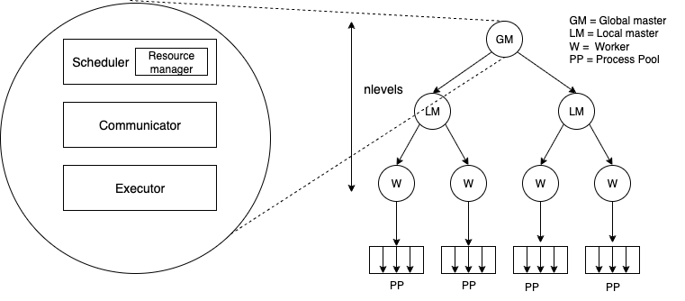

# Ensemble Launcher

[](https://www.python.org/downloads/)

A lightweight, scalable tool for launching and orchestrating task ensembles across HPC clusters with intelligent resource management and hierarchical execution.

---

## Table of Contents

- [Features](#features)
- [Installation](#installation)
- [Quick Start](#quick-start)
- [Architecture](#architecture)
- [Configuration](#configuration)
  - [Basic Configuration](#basic-configuration)
  - [Advanced Configuration](#advanced-configuration)
  - [Resource Pinning](#resource-pinning)
- [Execution Modes](#execution-modes)
- [Examples](#examples)
- [Performance Tuning](#performance-tuning)
- [API Reference](#api-reference)
- [Testing](#testing)
- [Contributing](#contributing)
- [Support](#support)

---

## Features

- **Flexible Execution**: Support for serial, MPI, and mixed workloads
- **Intelligent Scheduling**: Automatic resource allocation with customizable policies
- **Hierarchical Architecture**: Efficient master-worker patterns for large-scale deployments (1-2048+ nodes)
- **Multiple Communication Backends**: Choose between Python multiprocessing, [ZMQ](https://zeromq.org/), or [DragonHPC](https://dragonhpc.org/portal/index.html) for performance at scale
- **Resource Pinning**: Fine-grained CPU and GPU affinity control
- **Real-time Monitoring**: Track task execution with configurable status updates
- **Fault Tolerance**: Graceful handling of task failures with detailed error reporting
- **Python & Shell Support**: Execute Python callables or shell commands seamlessly

---

## Installation

### Requirements

- Python 3.6+
- numpy
- matplotlib
- scienceplots
- pytest
- cloudpickle
- pydantic
- pyzmq

### Optional Dependencies

- MPI implementation (for distributed execution via `mpirun` or `mpiexec`)
- [DragonHPC](https://github.com/DragonHPC/dragon) (for extreme-scale deployment on HPC systems)
- [mcp](https://github.com/modelcontextprotocol/python-sdk?tab=readme-ov-file) and [paramiko] (https://www.paramiko.org/) for hosting mcp server on HPC compute nodes

### Quick Install

```bash
git clone https://github.com/argonne-lcf/ensemble_launcher.git
cd ensemble_launcher
python3 -m pip install .
```

---

## Quick Start

### 1. Define Your Ensemble

Create a JSON configuration file describing your task ensemble:

```json
{
    "ensembles": {
        "example_ensemble": {
            "nnodes": 1,
            "ppn": 1,
            "cmd_template": "./exe -a {arg1} -b {arg2}",
            "arg1": "linspace(0, 10, 5)",
            "arg2": "linspace(0, 1, 5)",
            "relation": "one-to-one"
        }
    }
}
```

The configuration specifies an ensemble with:

- Tasks running on a single node with a single process per node
- Tasks executed with `./exe -a {arg1} -b {arg2}` taking two input arguments
- The values of the two input arguments are defined as 5 linearly spaced numbers between 0-10 and 0-1 for `arg1` and `arg2`, respectively.
- The raletionship between the values of the two arguments is set to `one-to-one`, meaning the ensemble consists of 5 tasks, one for each pair of values. 

**Supported Relations:**
- `one-to-one`: Pair parameters element-wise (N tasks)
- `many-to-many`: Cartesian product of parameters (N×M tasks)

### 2. Create a Launcher Script

```python
from ensemble_launcher import EnsembleLauncher

if __name__ == '__main__':
    # Auto-configure based on system and workload
    el = EnsembleLauncher("config.json")
    results = el.run()
    
    # Write results to file
    from ensemble_launcher import write_results_to_json
    write_results_to_json(results, "results.json")
```

### 3. Execute

```bash
python3 launcher_script.py
```

---

## Architecture



### Key Components

- **EnsembleLauncher**: Main API entry point with auto-configuration
- **Global/Local Master**: Orchestrates workers, handles task distribution and aggregation
- **Worker**: Executes tasks using configured executor
- **Scheduler**: Allocates resources across cluster nodes with intelligent policies
- **Executors**: Backend task launching engines (Python multiprocessing, MPI, DragonHPC)
- **Communication Layer**: ZMQ or Python multiprocessing pipes

### Hierarchical Execution Model

The master-worker architecture scales from single nodes to thousands of nodes:
- **Single Node** (nlevels=0): Direct execution without master overhead
- **Small Scale** (nlevels=1): Global master coordinates workers directly
- **Large Scale** (nlevels=2): Global master → Local masters → Workers for thousands of tasks
- **Extreme Scale** (nlevels=3): Deep hierarchy for supercomputer-scale deployments

---

## Configuration

### Basic Configuration

The launcher automatically configures itself based on your workload and system:

```python
from ensemble_launcher import EnsembleLauncher

el = EnsembleLauncher(
    ensemble_file="config.json",
    Nodes=["node-001", "node-002"],  # Optional: auto-detects from PBS_NODEFILE, works only on PBS
    pin_resources=True,              # Enable CPU/GPU pinning
    return_stdout=True               # Capture task output
)
```

### Advanced Configuration

For fine-grained control, explicitly configure system and launcher settings:

```python
from ensemble_launcher import EnsembleLauncher
from ensemble_launcher.config import SystemConfig, LauncherConfig

# Define system resources
system_config = SystemConfig(
    name="my_cluster",
    ncpus=104,                      # CPUs per node
    ngpus=12,                       # GPUs per node
    cpus=list(range(104)),          # Specific CPU IDs (optional)
    gpus=list(range(12))            # Specific GPU IDs (optional)
)

# Configure launcher behavior
launcher_config = LauncherConfig(
    child_executor_name="mpi",      # multiprocessing, mpi, dragon
    task_executor_name="mpi",       # Executor for tasks
    comm_name="zmq",                # multiprocessing, zmq, dragon
    nlevels=2,                      # Hierarchy depth (auto-computed if None)
    report_interval=10.0,           # Status update frequency (seconds)
    return_stdout=True,             # Capture stdout
    worker_logs=True,               # Enable worker logging
    master_logs=True                # Enable master logging
)

el = EnsembleLauncher(
    ensemble_file="config.json",
    system_config=system_config,
    launcher_config=launcher_config,
    pin_resources=True
)

results = el.run()
```

### Resource Pinning

Pin tasks to specific CPUs and GPUs for optimal performance:

```json
{
    "ensembles": {
        "pinned_ensemble": {
            "nnodes": 1,
            "ppn": 4,
            "cmd_template": "./gpu_code",
            "cpu_affinity": "0,1,2,3",
            "gpu_affinity": "0,1,2,3",
            "ngpus_per_process": 1
        }
    }
}
```
Resources are pinned using the `gpu_selector` option in the LauncherConfig (defaults to "ZE_AFFINITY_MASK" for Intel GPUs). The specific string the `gpu_selector` is set to depends on the SystemConfig. For example, setting:

```python
system_config = SystemConfig(
    name="my_cluster",
    cpus=list(range(104)),          # Specific CPU IDs (optional)
    gpus=['0','0','1','1','2','3']  # Specific GPU IDs (optional)
)
```
will overload the GPU 0 and 1 and the Scheduler assumes that node has a 6 GPUs instead of 4 GPUs.

---

## Execution Modes

### Python Callables

Execute Python functions directly:

```python
def my_simulation(param_a, param_b):
    # Your simulation code
    return result

from ensemble_launcher.ensemble import Task

tasks = {
    "task-1": Task(
        task_id="task-1",
        nnodes=1,
        ppn=1,
        executable=my_simulation,
        args=(10, 0.5)
    )
}

el = EnsembleLauncher(
    ensemble_file=tasks,  # Pass dict directly
    return_stdout=True
)
results = el.run()
```
Note that, internally, the dictionary definition of the ensemble is converted to a collection of Task()s. 
### Shell Commands

Execute binaries and shell commands with files as inputs:

```json
{
    "ensembles": {
        "shell_ensemble": {
            "nnodes": 1,
            "ppn": 1,
            "cmd_template": "./simulation --config {config_file}",
            "config_file": ["config1.json", "config2.json", "config3.json"],
            "relation": "one-to-one"
        }
    }
}
```
which is launched using the following script. 


```python
from ensemble_launcher import EnsembleLauncher

if __name__ == '__main__':
    # Auto-configure based on system and workload
    el = EnsembleLauncher("config.json")
    results = el.run()
    
    # Write results to file
    from ensemble_launcher import write_results_to_json
    write_results_to_json(results, "results.json")
```

## MCP

Transform @mcp.tool into ensemble tool that can perform an ensemble of tool executions using a single AI tool call

```python
from ensemble_launcher.mcp import Server
from sim_script import sim

mcp = Server(port=9276)

tool = mcp.ensemble_tool(sim)
"""
or

@mcp.ensemble_tool
def sim(a:float,b:float)->str:
    return "Done sim"

or 

from ensemble_launcher.config import LaucherConfig, SystemConfig
@mcp.ensemble_tool(launcher_config = LauncherConfig(...), system_config = SystemConfig(...))
def sim(a: float, b:floar)->str:
    return "Done sim"
"""

if __name__ == "__main__":
    mcp.run(transport="streamable-http")
```

We also provide some tooling for port forwarding between compute and login nodes. In the client script do the following

```python
from ensemble_launcher.mcp import start_tunnel, stop_tunnel
if __name__ == "__main__":
    ret = start_tunnel("<User name>","<Job head node host name>",9276,9276)
    asyncio.run(main())
    stop_tunnel(*ret)
```

---

## Examples

See the [`examples`](examples/) directory for complete workflow samples:

### C++ Examples
- [`examples/c++/workflow_pattern1.py`](examples/c++/workflow_pattern1.py) - Basic parallel execution
- [`examples/c++/workflow_pattern2.py`](examples/c++/workflow_pattern2.py) - Parameter sweeps
- [`examples/c++/workflow_pattern3.py`](examples/c++/workflow_pattern3.py) - Complex dependencies

<!-- ### Python Examples
- [`examples/python/mpi_example.py`](examples/python/mpi_example.py) - MPI-based execution
- [`examples/python/serial_example.py`](examples/python/serial_example.py) - Serial task execution -->

---

## Performance Tuning

### Communication Backend Selection

| Backend          | Best For                    | Nodes    |
|------------------|-----------------------------|----------|
| `multiprocessing`| Single node, small ensembles| 1        |
| `zmq`            | Multi-node, large scale     | 2-2048+  |

### Hierarchy Levels

The launcher automatically determines hierarchy depth based on node count, but you can override it with:

```python
launcher_config = LauncherConfig(
    nlevels=0   # Direct worker execution (single node)
    nlevels=1   # Master + Workers (up to ~64 nodes)
    nlevels=2   # Master + Sub-masters + Workers (64-2048 nodes)
    nlevels=3   # Deep hierarchy (2048+ nodes)
)
```

**Auto-computed hierarchy:**
- 1 node: `nlevels=0` (worker only)
- 2-64 nodes: `nlevels=1` (master + workers)
- 65-2048 nodes: `nlevels=2` (master + sub-masters + workers)
- 2048+ nodes: `nlevels=3` (deep hierarchy)

### Monitoring and Debugging

Enable logging for detailed execution traces:

```python
# import logging
# logging.basicConfig(level=logging.INFO)

launcher_config = LauncherConfig(
    worker_logs=True,
    master_logs=True,
    report_interval=5.0,  # Report status every 5 seconds
    profile = "basic" or "timeline" #basic ouputs the communication latencies and task runtime. timeline outputs the mean, std, sum, and counts of various events in the orchestrator
)
```

Logs are written to `logs/master-*.log` and `logs/worker-*.log`. Profiles are written to `profiles/*`

---

## API Reference

### EnsembleLauncher

```python
EnsembleLauncher(
    ensemble_file: Union[str, Dict[str, Dict]],
    system_config: SystemConfig = SystemConfig(name="local"),
    launcher_config: Optional[LauncherConfig] = None,
    Nodes: Optional[List[str]] = None,
    pin_resources: bool = True,
    return_stdout: bool = False
)
```

**Parameters:**
- `ensemble_file`: Path to JSON config or dict of task definitions
- `system_config`: System resource configuration
- `launcher_config`: Launcher behavior configuration (auto-configured if None)
- `Nodes`: List of compute nodes (auto-detected if None)
- `pin_resources`: Enable CPU/GPU affinity
- `return_stdout`: Capture task stdout

**Methods:**
- `run()`: Execute ensemble and return results

### SystemConfig

```python
SystemConfig(
    name: str,
    ncpus: int = mp.cpu_count(),
    ngpus: int = 0,
    cpus: List[int] = [],
    gpus: List[Union[str, int]] = []
)
```

### LauncherConfig

```python
LauncherConfig(
    child_executor_name: Literal["multiprocessing","dragon","mpi"] = "multiprocessing",
    task_executor_name: Literal["multiprocessing","dragon","mpi"] = "multiprocessing",
    comm_name: Literal["multiprocessing","zmq","dragon"] = "multiprocessing",
    report_interval: float = 10.0,
    nlevels: int = 1,
    return_stdout: bool = False,
    worker_logs: bool = False,
    master_logs: bool = False,
    nchildren: Optional[int] = None #Forces number of children at every level
    profile: Optional[Literal["basic","timeline"]] = None
    gpu_selector: str = "ZE_AFFINITY_MASK"
)
```

---

## Testing

Run the test suite:

```bash
pytest tests/
```

Run specific tests:

```bash
pytest tests/test_el.py          # End-to-end tests
pytest tests/test_executor.py    # Executor tests
pytest tests/test_master.py      # Master/Worker tests
```

---

## Contributing

We welcome contributions! Please:

1. Fork the repository
2. Create a feature branch (`git checkout -b feature/amazing-feature`)
3. Commit changes (`git commit -m 'Add amazing feature'`)
4. Push to branch (`git push origin feature/amazing-feature`)
5. Open a Pull Request

### Development Setup

```bash
git clone https://github.com/argonne-lcf/ensemble_launcher.git
cd ensemble_launcher
python3 -m pip install -e ".[dev]"
pytest tests/
```

---

## Support

- **Issues**: [GitHub Issues](https://github.com/argonne-lcf/ensemble_launcher/issues)
- **Discussions**: [GitHub Discussions](https://github.com/argonne-lcf/ensemble_launcher/discussions)
- **Documentation**: See [`examples`](examples/) directory

---

## Acknowledgments

This work was supported by the U.S. Department of Energy, Office of Science, under contract DE-AC02-06CH11357.

---

## Citation

If you use Ensemble Launcher in your research, please cite:

```bibtex
@software{ensemble_launcher,
  title = {Ensemble Launcher: Scalable Task Orchestration for HPC},
  author = {Argonne National Laboratory},
  year = {2025},
  url = {https://github.com/argonne-lcf/ensemble_launcher}
}
```


